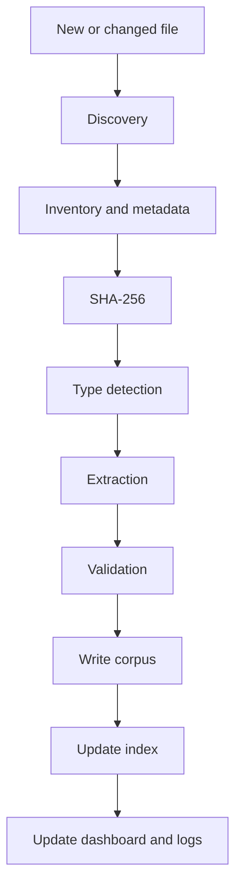
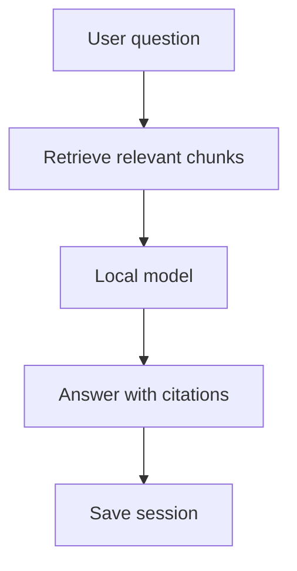
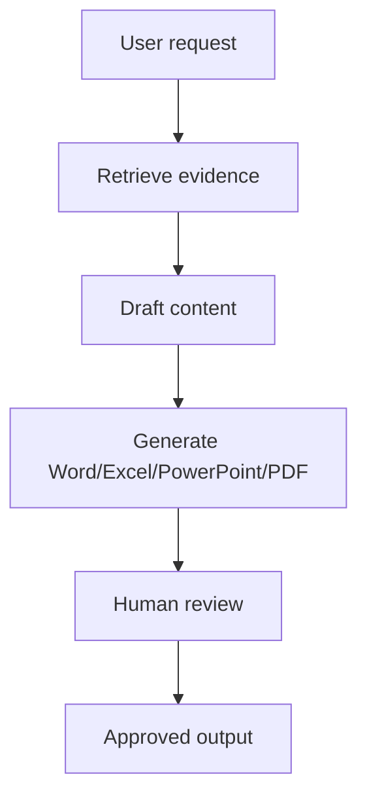

# Docling AI
## Local Knowledge Workbench — Single Source of Truth

> **Single authoritative README — architecture, implementation, operations, troubleshooting, and roadmap.**  
> Generic. Public-safe. No organization names. No sensitive data.  
> **Not affiliated with the Docling open-source project or its maintainers.**

---

## Table of Contents

- [1. Executive Summary](#1-executive-summary)
- [2. Design Goals](#2-design-goals)
- [3. Non-Negotiable Principles](#3-non-negotiable-principles)
- [4. What This System Must Do](#4-what-this-system-must-do)
- [5. What This System Must Never Do](#5-what-this-system-must-never-do)
- [6. Target Architecture](#6-target-architecture)
- [7. Operating Constraints](#7-operating-constraints)
- [8. Folder Model](#8-folder-model)
- [9. Supported File Types](#9-supported-file-types)
- [10. Inventory and Document Control Model](#10-inventory-and-document-control-model)
- [11. Pipeline End-to-End](#11-pipeline-end-to-end)
- [12. Canonical Output Formats](#12-canonical-output-formats)
- [13. Database and Search Strategy](#13-database-and-search-strategy)
- [14. Python Technology Stack](#14-python-technology-stack)
- [15. Local AI Strategy](#15-local-ai-strategy)
- [16. Command Center Dashboard](#16-command-center-dashboard)
- [17. Logging, Tracking, and Traceability](#17-logging-tracking-and-traceability)
- [18. Error Handling and Failure Modes](#18-error-handling-and-failure-modes)
- [19. Security and Blind Spots](#19-security-and-blind-spots)
- [20. Continuous Intake and Change Management](#20-continuous-intake-and-change-management)
- [21. Human Review, Corrections, and Governance](#21-human-review-corrections-and-governance)
- [22. Output Generation](#22-output-generation)
- [23. Audio and Video Future Layer](#23-audio-and-video-future-layer)
- [24. Roadmap and Phases](#24-roadmap-and-phases)
- [25. Micro-Task Delivery Standard](#25-micro-task-delivery-standard)
- [26. PowerShell Bootstrap Pattern](#26-powershell-bootstrap-pattern)
- [27. Python CLI Pattern](#27-python-cli-pattern)
- [28. Sample Dashboard Wireframe](#28-sample-dashboard-wireframe)
- [29. Sample Workflow Diagrams](#29-sample-workflow-diagrams)
- [30. Troubleshooting Playbook](#30-troubleshooting-playbook)
- [31. Best-Practice References](#31-best-practice-references)
- [32. Definition of Done](#32-definition-of-done)
- [33. Final Build Order](#33-final-build-order)
- [34. Final Principles](#34-final-principles)

---

## 🏗️ FOUNDATION GATE — BEFORE LAB 01

> [!CAUTION]
> Feature-first development is suspended. The project now uses a foundation-first engineering model. Read `docs/FOUNDATION-FIRST.md` before treating any current script as production-ready.

The foundation gate covers requirements traceability, architecture decisions, quality pillars, threat/failure modeling, environment qualification, lifecycle/data contracts, transaction/recovery semantics, observability, synthetic certification, supply-chain integrity, backup/restore, human operations and production-readiness evidence.

---
## 🚀 START HERE — HUMAN EXECUTION PATH

> [!IMPORTANT]
> The architecture below is not the execution sequence. The executable, micro-tasked build begins in **docs/ACTIONABLE-LABS.md** and uses **Windows PowerShell 5.1 / ISE** as the human control plane.

Current executable foundation files:

- `scripts/01-bootstrap.ps1` — standard-user preflight and creation of `C:\Projects\docling.ai`.
- `tests/01-smoke.ps1` — foundation verification.
- `scripts/02-corpusctl.ps1` — PowerShell 5.1 wrapper for deterministic Python operations.
- `src/docling_ai/corpusctl.py` — initial SQLite/inventory/hash/lifecycle engine.
- `docs/ACTIONABLE-LABS.md` — ordered Lab 00–24 execution path, expected results, stop gates, auto-healing boundary and troubleshooting.

**Do not put real corpus data into the system yet.** First pass the synthetic bootstrap, smoke, duplicate, rename/delete and reconciliation gates.

---
## 1. Executive Summary

**Docling AI** is a local-first knowledge workbench for handling large document estates, code repositories, images, and future media, then turning them into a traceable, searchable, governed corpus.

It is designed to:
- preserve all raw sources;
- account for every file;
- convert supported content into structured local formats;
- track status, exceptions, versions, and duplicates;
- support full-text search immediately;
- support hybrid/semantic search later;
- add local AI immediately after the corpus and search layers exist;
- generate new deliverables like Word, Excel, PowerPoint, PDF, diagrams, memos, and implementation artifacts;
- remain stable for years without rebuilding the foundation.

This is **not just a converter**. It is a **local document intelligence and authoring platform**.

---

## 2. Design Goals

### Core goals
- One local place for raw documents, code, conversations, and future media
- Deterministic inventory and traceability
- Incremental processing as new files arrive
- Robust logs and debugging records
- Local dashboard and command center
- Local AI Q&A and drafting with citations
- New document generation from trusted corpus
- Manual, step-by-step, human-operable implementation
- No dependency on cloud AI
- No requirement for Administrator rights
- No Docker requirement
- Public-safe generic documentation repository

### Quality goals
- Professional, enterprise-grade
- Explainable
- Extensible without breaking older data
- Recoverable
- Testable
- Auditable
- Searchable
- Human-readable and machine-readable

---

## 3. Non-Negotiable Principles

### 3.1 Preserve originals
`SOURCE` files are never modified by the engine.

### 3.2 100% file accounting
The target is **100% file accounting**, not a false promise of perfect extraction from every arbitrary file.

Every discovered file must end in a visible explicit state:

```text
SUCCESS
PARTIAL
FAILED
ENCRYPTED
UNSUPPORTED
DUPLICATE
INTENTIONALLY_EXCLUDED
PENDING_REVIEW
```

### 3.3 No silent loss
Nothing can disappear silently. If extraction fails, it must be recorded.

### 3.4 AI is downstream
AI consumes the trusted local corpus. AI is not the system of record.

### 3.5 Build in layers
Do not rebuild the foundation every time a new feature is added.

### 3.6 Source evidence and interpretation are separate
The platform must clearly distinguish:
- source evidence,
- extracted data,
- AI interpretation,
- human correction,
- approved decision.

---

## 4. What This System Must Do

### Ingest
- Read Word, Excel, PowerPoint, PDF, images, text, CSV, JSON, XML, YAML, logs, and code.
- Support modern file versions first.
- Add legacy support in a controlled manner.

### Convert
- Convert into Markdown, JSON, JSONL, and TXT.
- Preserve file relationships and provenance.

### Track
- Track every file, run, error, duplicate, and change.
- Track document creation/modified observations, hashes, versions, and processing state.

### Search
- Support exact search, metadata search, and later hybrid search.

### Explain
- Answer plain-language and technical questions locally.

### Draft
- Generate memos, summaries, comparison tables, architecture writeups, implementation notes, and presentations.

### Generate
- Create DOCX, XLSX, PPTX, PDF, diagrams, images, and code from the curated corpus.

### Grow
- Support continuous intake with no need to rebuild from scratch.

---

## 5. What This System Must Never Do

- Never overwrite original source files
- Never silently ignore unsupported files
- Never mark an unreadable or encrypted file as fully successful
- Never execute embedded macros, scripts, or code from source files
- Never automatically upload internal content to public sites or AI services
- Never let AI output replace original evidence
- Never break prior validated corpus data without migration/versioning
- Never store the only truth in conversation history
- Never claim “100% perfect extraction” from every arbitrary input file

---

## 6. Target Architecture

```text
SOURCE
  ├─ DOCUMENTS
  ├─ CONVERSATIONS
  ├─ CODE
  ├─ IMAGES
  ├─ AUDIO (future)
  ├─ VIDEO (future)
  └─ RESEARCH

        ↓

DISCOVERY
        ↓
INVENTORY
        ↓
SHA-256
        ↓
TYPE DETECTION
        ↓
SAFE EXTRACTION
        ↓
VALIDATION
        ↓
CANONICAL CORPUS
  ├─ Markdown
  ├─ JSON
  ├─ JSONL chunks
  ├─ TXT
  └─ extracted media

        ↓

SEARCH / INDEX
  ├─ metadata search
  ├─ full text
  └─ hybrid semantic later

        ↓

LOCAL AI
  ├─ Q&A
  ├─ explain
  ├─ compare
  ├─ summarize
  ├─ draft
  └─ cite

        ↓

OUTPUTS
  ├─ Word
  ├─ Excel
  ├─ PowerPoint
  ├─ PDF
  ├─ diagrams
  ├─ workflows
  ├─ reports
  └─ code
```

---

## 7. Operating Constraints

This guide assumes:
- Windows 11 Enterprise
- standard user rights
- no Administrator mode
- no Docker
- internet may be view-only or constrained
- local AI only
- GitHub repo used as a generic documentation library
- machine has approximately 32 GB RAM and limited storage
- implementation must be careful, low-risk, and incremental

### No-admin implication
A true Windows service normally requires admin/IT involvement. Until then:
- run via CLI;
- optionally run via user-session watcher;
- optionally run via scheduled user task if permitted.

---

## 8. Folder Model

Recommended root:

```text
C:\DoclingAI\
```

Top-level structure:

```text
C:\DoclingAI\
├── SOURCE\
├── CORPUS\
├── OUTPUT\
└── SYSTEM\
```

Recommended `SOURCE` subdivisions:

```text
SOURCE\
├── DOCUMENTS\
├── CONVERSATIONS\
├── CODE\
├── IMAGES\
├── AUDIO\
├── VIDEO\
└── RESEARCH\
```

Recommended `SYSTEM` structure:

```text
SYSTEM\
├── app\
├── config\
├── extractors\
├── writers\
├── generators\
├── logs\
├── manifests\
├── state\
├── reports\
├── templates\
├── tests\
├── temp\
├── indexes\
├── models\
└── packages\
```

---

## 9. Supported File Types

### 9.1 Priority business documents
- `.docx`
- `.xlsx`
- `.xlsm`
- `.pptx`
- `.pdf`

### 9.2 Images
- `.png`
- `.jpg`
- `.jpeg`
- `.tif`
- `.tiff`
- `.bmp`
- `.gif`
- `.webp`

### 9.3 Text and structured
- `.txt`
- `.md`
- `.csv`
- `.tsv`
- `.json`
- `.jsonl`
- `.xml`
- `.yaml`
- `.yml`
- `.ini`
- `.conf`
- `.log`

### 9.4 Code and infrastructure-as-code
- `.py`
- `.ps1`
- `.psm1`
- `.psd1`
- `.bat`
- `.cmd`
- `.sh`
- `.sql`
- `.tf`
- `.tfvars`
- `.bicep`
- `.js`
- `.ts`
- `.tsx`
- `.jsx`
- `.cs`
- `.java`
- `Dockerfile`
- `Makefile`

### 9.5 Future
- `.doc`
- `.xls`
- `.ppt`
- archives
- audio
- video
- additional specialized formats

---

## 10. Inventory and Document Control Model

Each discovered file must produce a tracked record.

### Minimum metadata fields

```yaml
document_id:
source_root:
source_class:
source_relative_path:
source_file_name:
source_extension:
source_size_bytes:
created_time_observed:
modified_time_observed:
sha256:
detected_type:
parser:
parser_version:
status:
first_seen_run:
last_seen_run:
supersedes:
superseded_by:
duplicate_of:
warning_count:
error_count:
```

### Core rules
- SHA-256 identifies content.
- Filenames do not define identity.
- Path changes are tracked.
- Duplicate files are recorded, not silently collapsed.
- Versions are related, not overwritten.

---

## 11. Pipeline End-to-End

```text
DISCOVER
→ INVENTORY
→ HASH
→ CLASSIFY
→ STABILIZE CHECK
→ EXTRACT
→ MEDIA INVENTORY
→ VALIDATE
→ NORMALIZE
→ CHUNK
→ WRITE CORPUS
→ WRITE INDEX
→ WRITE LOGS
→ UPDATE DASHBOARD
→ COMPLETE / EXCEPTION
```

### Stability checks
Before processing a file:
- ensure it exists;
- ensure it is readable;
- ensure it is not still being copied;
- ignore temporary Office files such as `~$filename.docx`;
- avoid symlink/junction loops where appropriate.

---

## 12. Canonical Output Formats

Each source file may produce:

```text
<stable-id>.md
<stable-id>.json
<stable-id>.meta.json
<stable-id>.chunks.jsonl
<stable-id>.txt
```

### Why multiple formats?

#### Markdown
- human-readable
- VS Code friendly
- AI-friendly context
- diffable

#### JSON
- canonical structured representation
- machine-friendly
- provenance and nested objects

#### JSONL
- chunk records
- search and retrieval pipelines
- semantic indexing later

#### TXT
- simple fallback
- grep/ripgrep friendly
- troubleshooting friendly

#### YAML
Use YAML mainly for:
- configuration
- manually maintained project records
- selected summary/control structures

---

## 13. Database and Search Strategy

### 13.1 Recommended baseline: SQLite
Use SQLite first.

Why:
- included in Python
- no server installation
- no admin rights required
- portable single file
- indexed
- transaction-safe
- easy backup

Use it for:
- inventory
- metadata
- processing state
- AI session records
- correction register
- dashboard queries

### 13.2 Start with exact and full-text search
Immediate capabilities:
- filename search
- metadata search
- SQL queries
- full-text search where available
- Markdown/TXT search via tooling

### 13.3 Hybrid search later
Add later:
- keyword search
- semantic similarity
- metadata filters
- date/version filters

### 13.4 Vector database?
**Not required initially.**

Start without:
- PostgreSQL
- pgvector
- Elasticsearch
- external vector DB

Add semantic indexing later only if justified.

---

## 14. Python Technology Stack

### Core orchestration
- Python standard library
- `sqlite3`
- `hashlib`
- `argparse`
- `json`
- `logging`
- `pathlib`

### Recommended local libraries
- Docling
- PyMuPDF
- pypdf
- python-docx
- openpyxl
- python-pptx
- Pillow
- lxml
- watchdog
- PyYAML
- Jinja2

### Why Python?
- local
- portable
- expressive
- excellent document ecosystem
- strong automation capability
- straightforward for long-term maintenance

---

## 15. Local AI Strategy

AI is added **immediately after**:
1. trusted corpus exists,
2. indexing/search exists,
3. citations are possible.

### Runtime
- Ollama is acceptable as a local runtime.

### Model strategy
Use at least two model profiles:

#### Fast model
Use for:
- Q&A
- quick summaries
- drafting
- classification
- document comparisons

#### Deeper model
Use for:
- architecture reasoning
- contradiction analysis
- multi-document synthesis
- heavier code review
- complex cross-source summaries

### General AI workflow

```text
Question
→ Retrieve relevant chunks
→ Ask local model
→ Generate answer
→ Include citations
→ Save session
```

### AI must support
- simple explanation mode
- technical explanation mode
- executive summary mode
- memo generation
- slide content generation
- worksheet/table generation
- code snippet generation
- explicit source citations

---

## 16. Command Center Dashboard

The dashboard is the local operational cockpit.

### Must show
- total discovered files
- total bytes
- new files
- changed files
- skipped files
- processed files
- success count
- partial count
- failed count
- encrypted count
- unsupported count
- duplicate count
- pending review
- source classes
- file family counts
- current run
- current file
- current stage
- percentage complete
- elapsed time
- throughput
- open exceptions
- disk usage
- last successful scan
- engine version
- schema version
- model status

### Suggested navigation
- Overview
- Runs
- Files
- Exceptions
- Duplicates
- Versions
- Corpus
- Search
- AI Chat
- Generated Outputs
- Corrections
- Research
- System Health
- Settings

### Visual style
- clean cards
- simple charts
- local-only assets
- no CDN
- no remote JS
- no telemetry

Suggested accent colors:
- Blue `#4285F4`
- Green `#34A853`
- Yellow `#FBBC05`
- Red `#EA4335`

---

## 17. Logging, Tracking, and Traceability

Minimum logs:

```text
engine.log
events.jsonl
exceptions.jsonl
audit.jsonl
performance.jsonl
ai_sessions.jsonl
```

### Every run should record
- run ID
- start time
- end time
- duration
- engine version
- configuration hash
- Python version
- package versions
- number of discovered files
- numbers by final state

### Every failed file should record
- document ID
- path
- stage
- exception code
- message
- parser
- parser version
- retry count
- resolution notes

---

## 18. Error Handling and Failure Modes

### Common failure categories
- file missing
- file locked
- partial copy in progress
- file corrupt
- file encrypted
- parser unsupported
- parser crashed
- OCR failed
- malformed XML/JSON
- storage full
- path too long
- encoding issues

### Required behavior
- do not crash the entire run if one file fails;
- record the exception;
- continue with the next file;
- expose failure on the dashboard;
- allow retry of one file or one batch later.

---

## 19. Security and Blind Spots

Explicitly handle these blind spots:

### Document and archive safety
- Office macros
- embedded executables
- malicious archives
- nested archives
- path traversal
- decompression bombs

### File-system safety
- symlinks
- junction loops
- temp files
- lock files
- deleted-after-discovery paths

### Information safety
- credentials in config
- secrets in code
- internal filenames in public GitHub docs
- screenshots with sensitive content
- prompt injection inside source files

### AI safety
Retrieved document text is **data**, not instruction.

---

## 20. Continuous Intake and Change Management

Files will continue arriving daily, weekly, and monthly.

### Rules
- unchanged files must be skipped;
- changed files must produce a new version record;
- path changes must be tracked;
- deleted source paths must be recorded;
- prior validated corpus must not be destroyed automatically.

### Intake modes
- manual scan
- dry run
- full scan
- watcher mode
- scheduled reconciliation

---

## 21. Human Review, Corrections, and Governance

The platform must differentiate:

```text
SOURCE EVIDENCE
EXTRACTED DATA
AI DRAFT
HUMAN CORRECTION
APPROVED OUTPUT
PUBLIC RESEARCH
```

### Correction register fields
- correction ID
- original claim
- source citation
- corrected statement
- reason
- evidence
- author
- date
- review status

---

## 22. Output Generation

Generate new artifacts from trusted corpus + templates.

### Word
- memos
- summaries
- architecture documents
- procedures
- implementation guides

### Excel
- inventories
- trackers
- RAID logs
- comparison matrices
- control matrices

### PowerPoint
- executive decks
- architecture reviews
- steering updates
- migration plans

### PDF
- generated from approved local source pipeline

### Diagrams and workflows
- Mermaid
- PlantUML
- Graphviz
- SVG
- simple generated PNGs
- PowerPoint shapes
- draw.io-compatible artifacts later if needed

### Code generation
- sample scripts
- configuration stubs
- template infrastructure code
- transformation utilities

---

## 23. Audio and Video Future Layer

### Audio pipeline
```text
audio
→ local transcription
→ timestamps
→ transcript
→ chunking
→ corpus
```

### Video pipeline
```text
video
→ audio extraction
→ transcription
→ key-frame extraction
→ OCR
→ transcript + image records
→ corpus
```

These are future phases. Do not block the document pipeline waiting for them.

---

## 24. Roadmap and Phases

### Phase 0 — Freeze rules
- naming
- folder model
- status states
- logging model
- success criteria

### Phase 1 — Bootstrap
- folder structure
- configuration
- CLI skeleton
- run IDs
- logs
- baseline dashboard

### Phase 2 — Inventory
- discovery
- SHA-256
- SQLite inventory
- JSONL manifest

### Phase 3 — Core extraction
- text and code
- DOCX
- XLSX
- PPTX
- PDF
- images/OCR

### Phase 4 — Validation
- structural checks
- media checks
- partial status
- retry handling

### Phase 5 — Corpus
- Markdown
- JSON
- JSONL
- TXT

### Phase 6 — Search
- exact
- metadata
- full text

### Phase 7 — Local AI
- retrieval
- local chat
- citations
- session logging

### Phase 8 — Authoring
- Word
- Excel
- PowerPoint
- PDF
- diagrams
- code

### Phase 9 — Advanced features
- hybrid semantic search
- vector layer if justified
- audio/video
- advanced code intelligence

---

## 25. Micro-Task Delivery Standard

Every implementation task in future docs should use this format:

```text
TASK ID
Purpose
Prerequisite
Files created/modified
Exact copy/paste command
Expected output
Validation
Log generated
Common errors
Troubleshooting
Rollback
Stop condition
Next task
```

This is mandatory for human/manual execution.

---

## 26. PowerShell Bootstrap Pattern

PowerShell should:
- ask a few questions;
- create the folder structure;
- create config files;
- create starter Python files;
- create logs/manifests/state folders;
- avoid downloads;
- avoid admin-only actions;
- avoid hidden network calls.

Use PowerShell for:
- bootstrap
- diagnostics
- launch convenience
- recovery actions

Do **not** make PowerShell the whole system. Python remains the core product.

---

## 27. Python CLI Pattern

Recommended control plane:

```text
corpusctl init
corpusctl scan --dry-run
corpusctl scan
corpusctl validate
corpusctl status
corpusctl dashboard
corpusctl watch
corpusctl retry --failed
corpusctl ingest --file <path>
corpusctl report
```

This is more sustainable than many unrelated `.bat` files.

Batch/command shortcuts can exist later, but Python CLI is the primary interface.

---

## 28. Sample Dashboard Wireframe

```text
┌──────────────────────────────────────────────────────────────┐
│ DOCLING AI — COMMAND CENTER                                 │
├──────────────────────────────────────────────────────────────┤
│ Source Files  18,432   Success  18,101   Failed      18     │
│ New              12    Partial      64   Unsupported  10    │
│ Changed           7    Duplicate   230   Encrypted     9    │
├──────────────────────────────────────────────────────────────┤
│ Current Run: RUN-YYYYMMDD-HHMMSS                            │
│ Current File: architecture_pack_v7.pdf                      │
│ Current Stage: VALIDATION                                   │
│ Progress: [█████████████████████░░░░░░] 78%                 │
├──────────────────────────────────────────────────────────────┤
│ Documents  Code  Conversations  Images  OCR  Outputs        │
│ Exceptions  Search  AI Chat  Corrections  Research          │
├──────────────────────────────────────────────────────────────┤
│ Open Exceptions                                              │
│ - PDF_ENCRYPTED: 9                                           │
│ - OCR_LOW_CONFIDENCE: 23                                     │
│ - PARSER_ERROR: 11                                           │
└──────────────────────────────────────────────────────────────┘
```

---

## 29. Sample Workflow Diagrams

### 29.1 Ingestion workflow



### 29.2 AI workflow



### 29.3 Output authoring workflow



---

## 30. Troubleshooting Playbook

### If a file is missing from the corpus
1. Check it exists in `SOURCE`.
2. Check the inventory database.
3. Check manifest record.
4. Check exception log.
5. Check whether it was unsupported, encrypted, or partial.
6. Retry that file only.

### If a PDF seems incomplete
1. Compare page count.
2. Inspect zero-text pages.
3. Check OCR queue.
4. Check images.
5. Compare alternate parser path if configured.

### If Excel looks incomplete
1. Confirm sheet count.
2. Check hidden sheets.
3. Check formulas.
4. Check named ranges.
5. Check charts/images.

### If Word missed images/tables
1. Check high-level parser output.
2. Inspect underlying OOXML media if using such logic.
3. Record discrepancy and mark partial if needed.

### If the engine crashes
1. Preserve logs.
2. Confirm no source modification occurred.
3. Restart from last known state.
4. Re-run reconciliation.

---

## 31. Best-Practice References

- Docling: <https://docling-project.github.io/docling/>
- Docling supported formats: <https://docling-project.github.io/docling/usage/supported_formats/>
- PyMuPDF: <https://pymupdf.readthedocs.io/>
- pypdf: <https://pypdf.readthedocs.io/>
- python-docx: <https://python-docx.readthedocs.io/>
- openpyxl: <https://openpyxl.readthedocs.io/>
- python-pptx: <https://python-pptx.readthedocs.io/>
- Pillow: <https://pillow.readthedocs.io/>
- Python sqlite3: <https://docs.python.org/3/library/sqlite3.html>
- watchdog: <https://python-watchdog.readthedocs.io/>

---

## 32. Definition of Done

### File-level done
A file is done when:
- it is discovered;
- it has an ID;
- its hash is recorded;
- its type is known;
- its status is explicit;
- its outputs are written where supported;
- any exceptions are recorded;
- the dashboard reconciles it.

### Repository-level done
A repository is done when:
- every discovered file is accounted for;
- there are no unknown outcomes;
- exceptions are visible;
- recovery is documented;
- versions and schemas are pinned;
- AI outputs can cite local evidence;
- generated artifacts carry review state.

---

## 33. Final Build Order

Follow this order and do not skip ahead:

```text
1. Bootstrap
2. Dry-run discovery
3. Inventory + SHA-256
4. SQLite inventory
5. Dashboard baseline
6. Text/code extractor
7. DOCX extractor
8. XLSX extractor
9. PPTX extractor
10. PDF extractor
11. Image/OCR extractor
12. Validation layer
13. Markdown/JSON/JSONL/TXT outputs
14. Full-text search
15. Local AI retrieval/chat
16. Output generation
17. Hybrid semantic search
18. Audio/video
19. Advanced code intelligence
```

---

## 34. Final Principles

> **Preserve everything. Account for everything. Validate everything. Make failures visible. Search before reasoning. Cite before drafting. Keep AI local. Keep evidence separate from interpretation. Extend by layers without breaking the foundation.**

---

## Appendix A — Suggested Icon/Visual Language

Use a consistent icon style in the repo or dashboard:

- 📁 Folders / storage
- 📄 Documents
- 📊 Excel/data
- 📽️ Presentations
- 🖼️ Images
- 🧠 AI
- 🔍 Search
- 🧾 Logs
- ⚠️ Exceptions
- ✅ Success
- ❌ Failure
- 🔁 Retry
- 🛠️ System
- 🧪 Tests
- 📚 Knowledge base
- 🌐 Public research
- 🧭 Command center

---

## Appendix B — Recommended Repo Layout

For a public-safe generic repository:

```text
README.md
MASTER_GUIDE.md
SECURITY.md
TROUBLESHOOTING.md
CHANGELOG.md

docs/
  architecture.md
  phases.md
  operations.md
  dashboard.md
  ai.md

scripts/
  bootstrap/
  examples/

templates/
  config/
  output/

tests/
  synthetic/

images/
  dashboard/
  workflow/
```

**Repository rule:** `README.md` is the authoritative master guide. Supporting code/assets may be added later, but duplicate master guides must not be created.

---

## Appendix C — Suggested Screenshot Placeholders

Later, if you want a polished repo page, add these screenshots/images:

1. Folder structure screenshot
2. Dry-run terminal screenshot
3. Dashboard overview screenshot
4. Exception detail screenshot
5. AI chat with citations screenshot
6. Generated output example screenshot
7. Workflow diagram image
8. Architecture overview image

For public-safe repos, use only synthetic or redacted examples.

---

## Appendix D — Naked Truth Summary

The practical truth is:

- no system will perfectly extract every arbitrary file;
- the right professional control is explicit accounting and visible exceptions;
- local AI is useful only after trusted retrieval exists;
- Python + SQLite + local files is the simplest robust foundation;
- semantic search is optional at first;
- Docker is not necessary to start;
- public GitHub must remain generic;
- the best long-term system is layered, versioned, testable, and boringly reliable.
